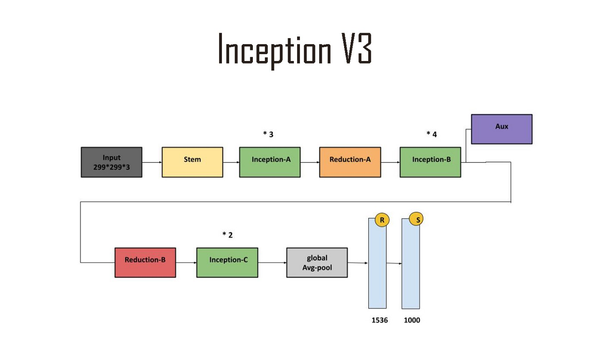

# InteligenciaArtificialAvanzadaII
Repositorio de la concentración de Inteligencia Artificial Avanzada II.

## Face Detection

Momento de Retroalimentación correspondiente al Módulo 2 "Técnicas y arquitecturas de deep learning".

Este humilde proyecto nace del deseo de desarrollar e implementar en el futuro una aplicación para la detección de rostros.

### Descripción

En **FaceDetection.ipynb** se encuentra el código que permite la detección de mi rostro por medio de imagenes, las cuáles pertenecen a un conjunto de datos generado por mí con ayuda de las librerías **albumentations** y **labelme**. El modelo de aprendizaje profundo toma como base el modelo de clasificación de imágenes de Keras **InceptionV3** (cargado con pesos preentrenados en ImageNet y sin la última capa de red), al cuál se le suman dos pequeños modelos: clasificación y regresión, para la clasificación binaria existente y la predicción de las 4 coordenadas que permiten la detección del rostro. 

Nota: si desea conocer más acerca de la creación y expansión del conjunto de datos o la implementación y evaluación del modelo de detección, por favor consulte el pdf **FaceDetectionModel_A01750884**.

### Referencias
* CNN Architectures. (2022). En J. Arriaga (Comp.), TC3007C: Inteligencia artificial avanzada para la ciencia de datos II. Instituto Tecnológico de Monterrey Campus Estado de México. https://drive.google.com/drive/u/1/folders/13K5k8mIMRiBcscpGC2yziuFxcXPLYHqr
* Nicolas Renotte. (5 de mayo de 2022). Build a Deep Face Detection Model with Python and Tensorflow | Full Course [Archivo de video]. YouTube. https://www.youtube.com/watch?v=N_W4EYtsa10&t=5431s 
* Brital, A. (23 de octubre de 2021). Inception V3 CNN Architecture Explained. Medium. https://medium.com/@AnasBrital98/inception-v3-cnn-architecture-explained-691cfb7bba08

## Autor
Abraham Gil Félix
